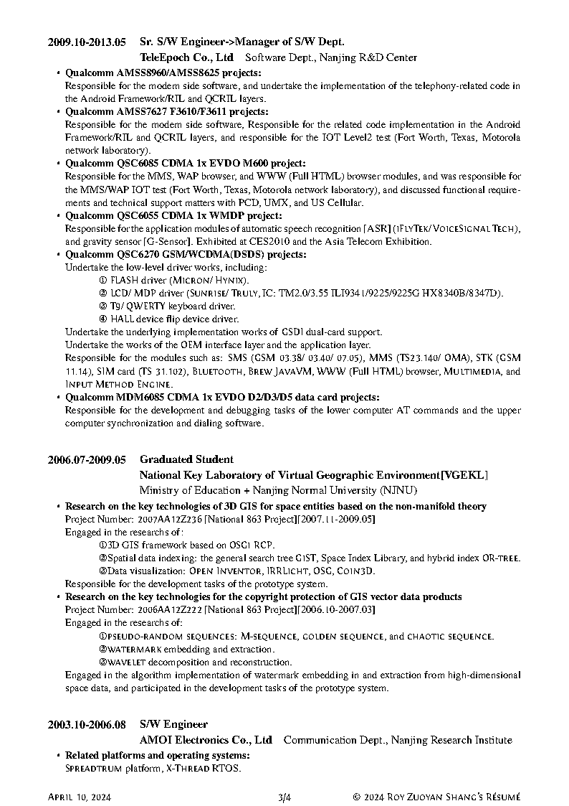
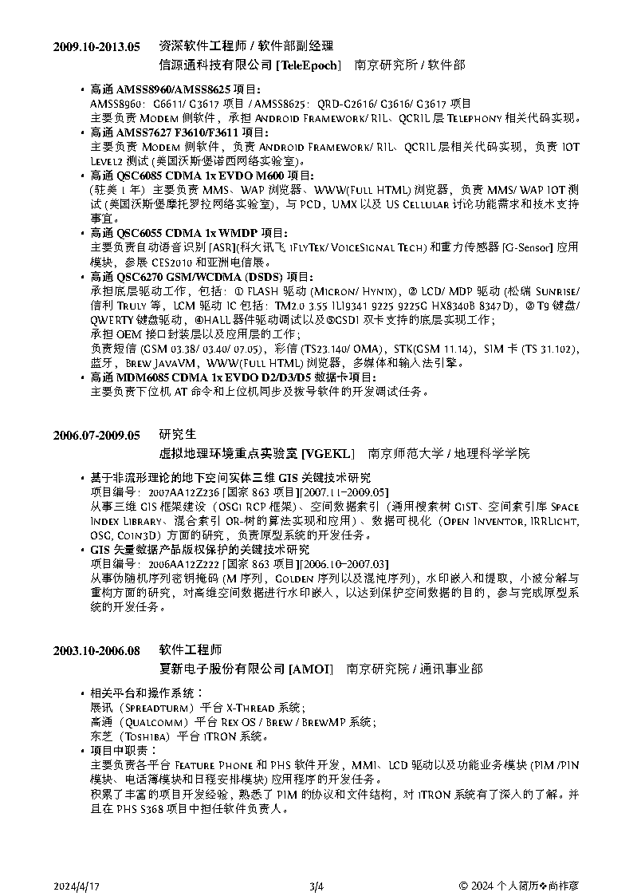
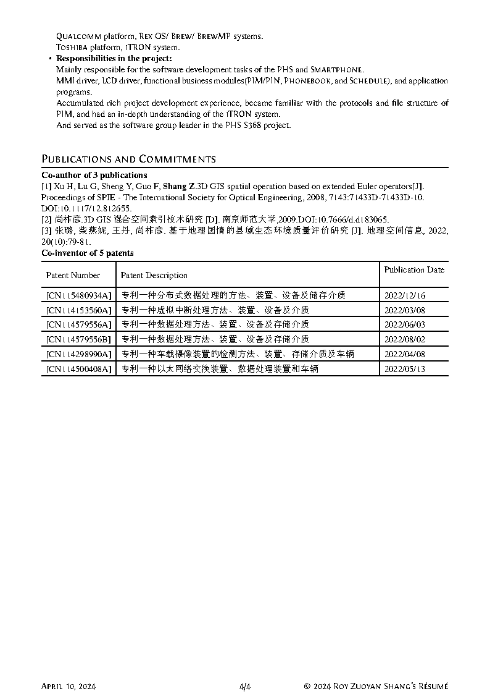
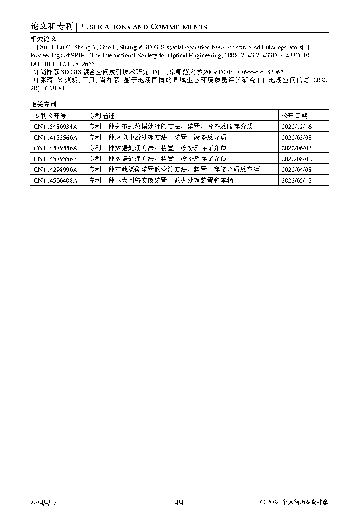

* content
{:toc}

## 关于我

|||
|:--|:--|
|||
|||
|||
|||
<a href="https://shangzuoyan.github.io/resume/images/resume_Page1.png" target="_blank">
 
<a href="https://shangzuoyan.github.io/resume/images/resume_Page2.png" target="_blank">
 
<a href="https://shangzuoyan.github.io/resume/images/resume_Page3.png" target="_blank">
 
<a href="https://shangzuoyan.github.io/resume/images/resume_Page4.png" target="_blank">
 

## 联系我

* GitHub：[shangzuoyan](https://github.com/shangzuoyan)
* Email：[shangzuoyan@hotmail.com](mailto:shangzuoyan@hotmail.com)
* 微博：[shangzuoyan](http://weibo.com/shangzuoyan)
* 知乎：[shangzuoyan](https://www.zhihu.com/people/shangzuoyan)
* Facebook：[shangzuoyan](https://www.facebook.com/shangzuoyan)

## 工作经历 | Work Experience

2021/01-至今		操作系统专家/基础软件经理|基础软件开发部		中汽创智科技有限公司
2017/10-2021/01	无线通信课-专理课长|IDM3事业处						富智康（南京）通讯有限公司
2016/01-2017/10	无线技术专家/技术总监|智能终端事业本部			江苏润和软件股份有限公司
2013/05-2016/01	主任软件工程师|南京研究所									宇龙计算机通信科技（深圳）有限公司
2009/10-2013/05	资深软件工程师/软件部副经理|软件部					信源通科技有限公司
2006/07-2009/06	硕士研究生|虚拟地理环境组									虚拟地理环境国家重点实验室
2003/10-2006/08	软件工程师|南京研究院/通讯事业部						夏新电子股份有限公司

## Comments


